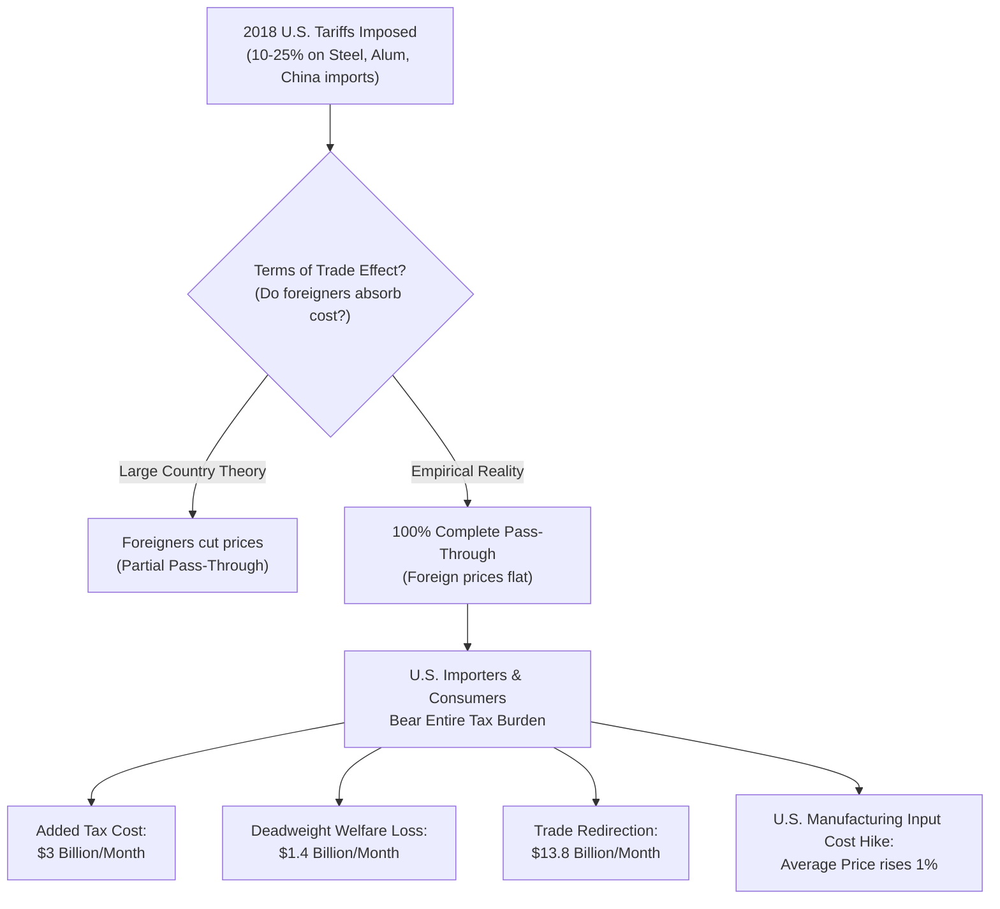

# GPCO 403 — Near-Term Academic Load Sweep & Week 9 Study Prep
**Course:** GPCO 403 International Economics  
**Professor:** Kyle Handley  
**Term:** Spring 2026  
**Date of Sweep:** May 27, 2026  
**Agent:** Plutus  

---

## 1. Overview & Load Sweep Summary

This briefing performs a Near-Term Academic Load Sweep for Week 9 and 10 of GPCO 403. It digests the assigned trade policy readings, resolves deadline ambiguities, and provides a clear operational strategy for the two upcoming deliverables: **Concept Check 5** and **Data Brief 2 (WTO Trade Profile Memo)**.

### Near-Term Deliverable Timeline

| Deliverable | Weight | Opens | Due Date | Format | Status | Strategic Priority |
| :--- | :---: | :--- | :--- | :--- | :--- | :--- |
| **Concept Check 5** | 4% | Wed, May 27 | **Mon, Jun 1** or **Tue, Jun 2** (ambiguous) | Canvas Quiz | Active (Opens Today) | **High** (Lowest CC dropped; check Canvas due date immediately) |
| **Data Brief 2** | 5% | Wed, May 20 | **Wed, Jun 3 at 11:59 PM** | 2-Hour Timed Canvas Memo | Active | **Critical** (Timed, randomized WTO trade profile analysis) |
| **Final Exam** | 40% | N/A | **Mon, Jun 8 at 8:00–11:00 AM** | In-Class | Upcoming | **Ultimate** (Cumulative, weighted toward last 5–6 weeks) |

> [!WARNING]
> **Concept Check 5 Due Date Discrepancy:** The syllabus narrative (p. 3) states Concept Check 5 is due **Monday, June 1**, whereas the syllabus course grid (p. 6) and the database tracker list it as due **Tuesday, June 2**. 
> **Strategic Action:** Edgar must check the live Canvas quiz settings immediately on May 27. Assume the earlier deadline of **Monday, June 1 at 23:59** for safety to prevent a late penalty (which is assessed even though the quiz remains open for an extra 24 hours).

---

## 2. In-Depth Reading Summaries

### Reading A: Feenstra & Taylor, Chapter 8 — Import Tariffs and Quotas under Perfect Competition

This chapter establishes the partial equilibrium models used to analyze the welfare effects of import tariffs and quotas under perfect competition. It contrasts the outcomes for small price-taking countries against large countries capable of influencing world prices.

#### A. The Small Country Case
*   **Definition:** A "small" country is a price taker in the world market. Its demand for imports is too small relative to global supply to influence the world price ($P_W$).
*   **Price Mechanism:** A specific tariff $t$ increases the domestic price of the imported good by the exact amount of the tariff: 
    $$P_{dist} = P_W + t$$
*   **Quantity Adjustments:**
    *   Domestic consumption falls from $D_1$ to $D_2$.
    *   Domestic production rises from $S_1$ to $S_2$.
    *   Imports fall from $M_1 = (D_1 - S_1)$ to $M_2 = (D_2 - S_2)$.
*   **Welfare Analysis (The Classic Diagram):**
    *   **Consumer Surplus (CS):** Decreases by $-(a + b + c + d)$. Consumers pay a higher price on fewer units.
    *   **Producer Surplus (PS):** Increases by $+a$. Domestic producers receive a higher price and expand along their marginal cost curve.
    *   **Government Revenue (Gov):** Increases by $+c = t \times M_2$. Collected on imported units.
    *   **Net National Welfare Change:** 
        $$\Delta W = \Delta CS + \Delta PS + \Delta Gov = -(a + b + c + d) + a + c = -(b + d)$$
    *   **Production Distortion ($b$):** The efficiency loss resulting from producing goods domestically at a higher marginal cost than the world price.
    *   **Consumption Distortion ($d$):** The efficiency loss resulting from consumers squeezing out mutually beneficial purchases due to the artificially high tariff price.
*   **Takeaway:** For a small country, a tariff *always* results in a net welfare loss equal to the deadweight loss $(b + d)$. There are no terms-of-trade gains.

#### B. The Large Country Case
*   **Definition:** A "large" country's import demand constitutes a significant share of the global market. Reducing its imports forces foreign exporters to lower their pre-tariff export prices to clear their inventories.
*   **Price Mechanism:** Imposing a tariff $t$ shifts the foreign export supply curve, forcing the world price down from $P_W$ to $P_W^*$. The new domestic price rises to:
    $$P_{dist} = P_W^* + t$$
    Importantly, the domestic price increase is *less* than the tariff: $(P_{dist} - P_W) < t$. The foreign exporter "absorbs" part of the tariff.
*   **Welfare Analysis:**
    *   **Consumer Surplus (CS):** Decreases by $-(a + b + c + d)$ based on the domestic price increase.
    *   **Producer Surplus (PS):** Increases by $+a$.
    *   **Government Revenue (Gov):** Increases by $+(c + e) = t \times M_2$.
        *   Area $c$ is paid by domestic consumers.
        *   Area $e = (P_W - P_W^*) \times M_2$ is paid by foreign exporters. This represents the **Terms of Trade (ToT) Gain**.
    *   **Net National Welfare Change:** 
        $$\Delta W = e - (b + d)$$
*   **Welfare Outcome:** **Ambiguous**. A large country gains if its Terms of Trade gain ($e$) exceeds the deadweight loss of domestic distortions ($b + d$).
*   **The Optimum Tariff:** The welfare-maximizing tariff rate for a large country. It is inversely related to the elasticity of foreign export supply ($\epsilon^*_X$):
    $$t_{opt} = \frac{1}{\epsilon^*_X}$$
    *   If foreign export supply is perfectly elastic ($\epsilon^*_X = \infty$, small country), the optimum tariff is $0$.
    *   A large country facing a less-than-perfectly-elastic supply has a positive optimum tariff. However, this invite **retaliation**, which can trigger a trade war where both countries end up worse off than under free trade (a classic Prisoner's Dilemma).

#### C. Import Quotas
*   **Definition:** A direct quantitative restriction on imports.
*   **Equivalence under Perfect Competition:** A quota set at import level $M_2$ produces the identical domestic price $P_{dist}$, domestic production $S_2$, domestic consumption $D_2$, and deadweight loss $(b + d)$ as a tariff $t$.
*   **The Quota Rent Difference:** The tariff revenue area $c$ is replaced by a **Quota Rent** of the same size: $c = (P_{dist} - P_W) \times M_2$. The net welfare depends on who captures this rent:
    1.  **Government Auction:** If the government auctions import licenses, it recovers area $c$. Net welfare matches the tariff: $-(b + d)$ (small country) or $e - (b + d)$ (large country).
    2.  **Domestic Importers:** If licenses are allocated to domestic firms, the rents stay in the country. However, firms may waste resources lobbying for these licenses, leading to unproductive **rent-seeking** costs that worsen the welfare loss.
    3.  **Foreign Exporters:** If the government gives the administration of the quota to foreign exporters (e.g., Voluntary Export Restraints or VERs), foreigners capture the rents. The home country loses area $c$, resulting in a severe welfare collapse of $-(b + c + d)$.

---

### Reading B: Feenstra & Taylor, Sections 11.1–11.2 — International Trade Agreements

These sections examine the institutional structures that govern global trade, focusing on the cooperative framework of the WTO/GATT and the economics of regional integration.

#### 11.1 The GATT and the World Trade Organization (WTO)
*   **The Cooperation Problem:** Unilaterally, large countries have incentives to impose tariffs to capture terms-of-trade gains. However, when all countries do this, everyone faces retaliatory tariffs, wiping out terms-of-trade gains and leaving all nations with high deadweight losses. Multilateral agreements act as commitment devices to escape this Prisoner's Dilemma.
*   **Two Core Pillars of the GATT/WTO:**
    1.  **Most-Favored-Nation (MFN) Principle (GATT Article I):** Non-discrimination across countries. Any trade concession or tariff reduction granted to one WTO member must be granted "immediately and unconditionally" to all other WTO members. You cannot favor one trading partner over another.
    2.  **National Treatment Principle (GATT Article III):** Non-discrimination between domestic and imported goods inside the border. Once an imported good clears customs and enters the domestic market, it must be treated no less favorably than a "like" domestic product. Internal taxes, safety standards, and regulations cannot be manipulated to protect domestic industries.

#### 11.2 Preferential Trade Agreements (PTAs)
GATT Article XXIV allows an exception to the MFN principle: countries can form Preferential Trade Agreements (PTAs) that lower tariffs exclusively for members, provided they eliminate barriers on "substantially all" trade between themselves and do not raise barriers on non-members.

*   **Two Primary Types of PTAs:**
    *   **Free Trade Area (FTA):** Members eliminate internal tariffs on trade among themselves but maintain their own independent, individual tariff schedules against non-members (e.g., USMCA / NAFTA).
        *   *Policy Hazard:* **Trade Deflection** — non-member countries will try to export goods into the FTA through the member country with the lowest external tariff.
        *   *Correction:* FTAs require complex **Rules of Origin (ROO)** to prove that goods were substantively produced within the member nations before receiving duty-free treatment.
    *   **Customs Union (CU):** Members eliminate internal tariffs and adopt a **Common External Tariff (CET)** schedule against all non-members (e.g., the European Union).
        *   *Benefit:* No rules of origin are required for internal trade, as all entry points apply the same tariff rate to non-member imports.

#### Welfare of PTAs: Viner’s Trade Creation vs. Trade Diversion
Preferential trade agreements are discriminatory by definition and do not guarantee welfare improvements. Jacob Viner (1950) established that the net welfare change depends on two opposing forces:

*   **Trade Creation:** This occurs when member country imports replace high-cost domestic production.
    *   *Mechanism:* A country begins importing a good from a partner because the partner's pre-tariff cost is lower than domestic production costs.
    *   *Welfare:* **Positive**. It leads to efficiency gains by shifting production to the more efficient partner country, reducing deadweight loss.
*   **Trade Diversion:** This occurs when lower-tariff imports from a partner country replace lower-cost, more efficient imports from a non-member country.
    *   *Mechanism:* A non-member country has the lowest production costs globally but faces a tariff. The partner country has higher production costs than the non-member but faces zero tariffs within the PTA. The tariff exclusion makes the partner's good artificially cheaper in the home market, shifting imports away from the globally efficient producer.
    *   *Welfare:* **Ambiguous but frequently negative**. While consumer surplus increases due to lower prices, the government suffers a massive loss in tariff revenue since imports from the partner are duty-free. If the lost tariff revenue exceeds the consumer surplus gain, national welfare falls.

---

### Reading C: Amiti, Mary, Stephen J. Redding, and David E. Weinstein (2019) — "The Impact of the 2018 Tariffs on Prices and Welfare"

This empirical paper measures the short-run price, trade, and welfare impacts of the tariffs imposed by the U.S. in 2018 (on washing machines, solar panels, steel, aluminum, and $250 billion of Chinese imports) and the subsequent retaliatory tariffs from trading partners.



#### A. The Central Empirical Finding: Complete Pass-Through
*   **The Surprise:** Standard trade theory predicts that because the United States is a "large country," foreign exporters would lower their pre-tariff prices to remain competitive, leading to partial pass-through and a terms-of-trade improvement for the U.S. (area $e$ in large-country diagrams).
*   **The Reality:** The researchers found **near-complete (100%) pass-through** of the tariffs into the domestic prices of imported goods. Foreign export prices (excluding the tariff) did *not* fall significantly.
*   **Conclusion:** The United States behaved like a "small country" in practice. It was unable to shift the tax burden onto foreign exporters. U.S. importers and consumers bore the **entire financial burden** of the tariffs.

#### B. Key Quantitative Metrics (Memorize for Concept Check / Exams)
1.  **Consumer and Firm Tax Costs:** By the end of 2018, the tariffs were costing U.S. buyers an additional **$3.0 billion per month** in added tax payments (transfers to the government).
2.  **Deadweight Welfare Loss:** The tariffs resulted in an aggregate U.S. real income loss (efficiency deadweight loss) of **$1.4 billion per month** by the end of 2018. This is pure economic waste that was not captured by government revenue or producer surplus.
3.  **Trade Redirection:** By November 2018, approximately **$13.8 billion of trade per month** was being redirected ($2.4 billion in exports and $11.4 billion in imports) away from tariffed countries toward non-tariffed countries (such as shifting supply chains from China to Vietnam or Taiwan). This corresponds to roughly **$165 billion on an annualized basis**.
4.  **Import Contractions:** In product categories directly subject to tariffs, import values contracted by **25 to 30 percent** relative to unaffected categories.
5.  **Manufacturing Supply Chain Impact:** Because many tariffs were placed on intermediate inputs (like steel and aluminum), the cost of production rose for domestic firms. The combined effect of input and output tariffs raised the average price of U.S. manufactured goods by **1.0 percentage point**.

#### C. Explaining the Complete Pass-Through
*   **Global Value Chains:** Modern supply chains are highly integrated and sticky. Importers could not easily swap suppliers, giving them zero leverage to force foreign price cuts.
*   **Product Differentiation:** Many targeted Chinese imports were specialized machinery and electronic parts with few close, immediate substitutes outside of China, making domestic demand highly inelastic in the short run.
*   **Competitive Pricing Responses:** As tariffs made foreign imports expensive, domestic U.S. producers of competing goods exploited this protection by raising their own domestic prices, magnifying the inflationary impact on consumers.

---

## 3. Concept Check 5 Strategy & Preparation

Concept Check 5 opens on **Wednesday, May 27** and is due on **Monday, June 1** (or **Tuesday, June 2** per grid; assume June 1).

### Core Theoretical Concepts Tested
1.  **Small vs. Large Country Tariff Calculations:**
    *   Be ready to compute Consumer Surplus loss ($- (a+b+c+d)$), Producer Surplus gain ($+a$), Government Revenue ($+c$ or $+ (c+e)$), and Deadweight Loss ($- (b+d)$) using linear demand and supply equations.
    *   Remember: Small Country DWL is *always* positive (welfare decreases). Large Country welfare change is $e - (b + d)$, which can be positive or negative.
2.  **Quota Welfare Calculations:**
    *   Understand the distribution of quota rents. If asked about a voluntary export restraint (VER), subtract the quota rent area $c$ from domestic welfare, leading to a total loss of $-(b + c + d)$.
3.  **Trade Creation vs. Trade Diversion Scenarios:**
    *   You will likely be presented with a three-country scenario (Home, Partner, Non-Member) and their unit supply costs.
    *   *Example Setup:* Home has a high cost ($10), Partner has a medium cost ($8), and Non-Member has a low cost ($6).
    *   *Tariff Scenario:* Home has a flat $3 tariff on all imports. 
        *   Cost of importing from Partner = $8 + $3 = $11.
        *   Cost of importing from Non-Member = $6 + $3 = $9.
        *   Home imports from Non-Member at price $9 (collecting $3 in tariff revenue).
    *   *PTA Scenario:* Home forms a PTA with Partner, eliminating tariffs on Partner but keeping the $3 tariff on Non-Member.
        *   Cost of importing from Partner = $8 (duty-free).
        *   Cost of importing from Non-Member = $6 + $3 = $9.
        *   Home now imports from Partner at price $8.
    *   *Welfare Analysis:* Home shifted imports from the globally efficient producer (Non-Member at real cost $6) to a less efficient partner (Partner at real cost $8) because of the tariff exclusion. This is a classic case of **Trade Diversion**.
4.  **GATT/WTO Core Principles:**
    *   Be prepared to classify scenarios as violating MFN (Article I) or National Treatment (Article III).
    *   *MFN Violation:* Charging a 5% tariff on goods from Japan and a 10% tariff on identical goods from Germany (without a valid PTA exception).
    *   *National Treatment Violation:* Clearing foreign cars at the border with a 2% tariff but then imposing a special "internal environmental registration tax" of 10% on imported cars while domestic cars pay 0%.
5.  **Empirical Metrics from Amiti et al. (2019):**
    *   Review the specific numbers: **$3B/month** in tax costs, **$1.4B/month** in deadweight loss, **$13.8B/month** in trade redirection, **25–30%** import contraction in tariffed sectors, and the **complete pass-through** finding.

---

## 4. Data Brief 2 Strategy: WTO Trade Profile Memo

### Assignment Parameters
*   **Format:** Timed Canvas Memo.
*   **Time Limit:** 2 Hours once opened. Must start by **10:00 PM on Wednesday, June 3** to get the full 2 hours before the 11:59 PM closing time.
*   **Role:** You are an economic analyst working for a U.S. firm that produces **mid-priced household appliances** (HS Code 85: Electrical Machinery).
*   **Task:** Review a randomized country's official **WTO Trade Profile** and decide whether exporting to this country is a **Good Idea**, **Bad Idea**, or **Unclear**. Write a professional, structured business memo justifying your recommendation.

---

### Step 1: Navigating the WTO Trade Profile Indicators

When the country is revealed and you open the WTO Trade Profile PDF, immediately locate and extract the following indicators:

```
                  WTO TRADE PROFILE DECODER
┌─────────────────────────────────┬─────────────────────────────────┐
│        TARIF PLANNER            │         POLICY RISK BOX         │
├─────────────────────────────────┼─────────────────────────────────┤
│ 1. MFN Applied Tariff           │ 3. Bound Tariff Coverage        │
│    - Simple average of MFN      │    - Percent of product lines   │
│      applied rates.             │      with legal tariff caps.    │
│    - Check the product group    │    - Ideal: 100% (or near).     │
│      "Electrical Machinery"     │                                 │
│      or "Machinery".            │ 4. Bound vs. Applied Gap        │
│                                 │    - "Water in the tariff"      │
│ 2. Trade-Weighted Average       │      = Bound - Applied.         │
│    - Accounts for trade volume. │    - Large gap = High policy    │
│    - If simple is high but      │      volatility risk.           │
│      weighted is low, high-     │                                 │
│      tariff goods are blocked.  │                                 │
├─────────────────────────────────┼─────────────────────────────────┤
│        MARKET STRUCTURE         │       INSTITUTIONAL BARRIERS    │
├─────────────────────────────────┼─────────────────────────────────┤
│ 5. Trade-to-GDP Ratio           │ 7. Trade Agreements (PTAs)      │
│    - Measures trade openness.   │    - Active FTA with the U.S.?  │
│    - (Exports + Imports)/GDP.   │    - If yes, applied tariff     │
│                                 │      is likely 0%.              │
│ 6. Global Import Share          │                                 │
│    - Shows country's scale      │ 8. Non-Tariff Barriers (NTBs)   │
│      and demand strength.       │    - TBT, SPS, import licensing │
│                                 │      notifications in WTO.      │
└─────────────────────────────────┴─────────────────────────────────┘
```

---

### Step 2: The Strategic Decision Matrix

Use this economic framework to determine your final recommendation:

#### A. Good Idea
*   **Tariff Conditions:** Low MFN applied tariffs on Electrical Machinery (e.g., $< 5\%$) OR an active Free Trade Agreement (FTA) with the U.S. that drops tariffs to $0\%$.
*   **Policy Risk:** $100\%$ binding coverage with a very narrow gap between Bound and Applied tariffs ("Water in the tariff" $< 2-3\%$). This guarantees the government cannot legally raise tariffs overnight.
*   **Market Openness:** High trade-to-GDP ratio relative to the country's size, indicating low structural or non-tariff barriers.

#### B. Bad Idea
*   **Tariff Conditions:** High MFN applied tariffs on Electrical Machinery (e.g., $> 15\%$), creating a massive cost disadvantage for imported mid-priced appliances.
*   **Policy Risk:** Large gap between Bound and Applied tariffs ("Water in the tariff" $> 20\%$) or low binding coverage. This signals that the country can drastically raise import duties at will, exposing your firm to crippling regulatory volatility.
*   **Market Barriers:** Extreme non-tariff barriers (excessive Technical Barriers to Trade notifications, complex licensing, or mandatory local testing requirements).

#### C. Unclear / Mixed (Requires Balance of Risk & Opportunity)
*   **Typical Scenario:** Low applied tariffs today (e.g., $3\%$), but a **massive bound-applied gap** (e.g., Bound rate is $35\%$). Applied tariffs could surge if the country faces a balance-of-payments crisis.
*   **Alternative Scenario:** High tariffs exist, but the country is a fast-growing, large market, or is currently negotiating an FTA with the U.S., making a long-term entry viable if near-term barriers are tolerated.

---

### Step 3: Structured Memo Outline

To write a highly polished, analytical, and professional memo in under 2 hours, follow this strict 4-section structure. Do not waffle; lead with your bottom-line recommendation.

#### Section 1: Executive Summary & Bottom-Line Recommendation (BLUF)
*   State the target country and your explicit recommendation (**Good Idea**, **Bad Idea**, or **Unclear**) in the first two sentences.
*   Provide a 3-sentence summary of the core economic rationale: the applied tariff rate on appliances, the policy volatility risk (the bound-applied gap), and key institutional factors (e.g., presence of an FTA).

#### Section 2: Tariff Analysis & Trade Policy Volatility
*   **The Numbers:** Report the simple average MFN applied tariff and the trade-weighted applied tariff for the "Electrical Machinery" or general manufacturing product group.
*   **Policy Risk Assessment:** Compare the Bound tariff rate to the Applied tariff rate. Identify the exact percentage of "Water in the tariff" (Bound $-$ Applied).
*   **Binding Coverage:** Report the tariff binding coverage percentage.
*   *Economic Logic:* Explain that high "water" allows the host government to legally raise tariffs unilaterally, which would severely damage the competitiveness of a U.S. exporter of mid-priced appliances.

#### Section 3: Market Access and Institutional Barriers
*   **Trade Agreements:** Analyze whether the country has an active Free Trade Agreement with the U.S. or is a member of major regional trade blocs. If a U.S. FTA exists, discuss how rules of origin might affect your appliance parts.
*   **Non-Tariff Barriers (NTBs):** Look at the WTO notifications for Technical Barriers to Trade (TBT) and import licensing. Note if these indicate hidden protectionist measures.
*   **Openness Metric:** Reference the country's trade-to-GDP ratio to demonstrate structural openness.

#### Section 4: Strategic Advice & Risk Mitigation
*   Provide concrete, actionable advice to your firm's executives.
*   *If Good:* Recommend immediate export launch, but advise on compliance with Rules of Origin if utilizing an FTA.
*   *If Bad:* Recommend against exporting. Instead, suggest either **Foreign Direct Investment (FDI)** to build a domestic plant inside their tariff wall, or establishing a joint venture with a local firm to bypass import restrictions.
*   *If Unclear:* Suggest a phased pilot export phase paired with currency hedging and a strict regulatory-watch trigger linked to the bound-applied gap.

---

## 5. Course Memory Updates

### A. Course Context & Prof. Handley's Tendencies
*   **Prof. Handley's Exam Strategy:** Handley's assessments place extreme value on **quantitative precision** paired with **clear welfare intuition**. Do not just manipulate variables; you must be comfortable explaining *why* the terms-of-trade gain occurs in the large country case (foreigners absorb part of the tax because their export supply is not perfectly elastic) and *why* it fails empirically (Amiti et al. showing complete pass-through due to global supply chain stickiness).
*   **Data Brief Style:** Keep your writing clear, analytical, and direct. Avoid fluff and corporate jargon. Anchor every claim in WTO Trade Profile statistics.

### B. Concept Check 5 Action Plan
*   **Verify Canvas Quiz Due Date:** Check the live quiz setting on Canvas immediately.
*   **Practice Small Country Calculations:** Complete a practice run of computing tariff CS, PS, Gov, and DWL to ensure mathematical speed.
*   **Practice Trade Creation/Diversion logic:** Be comfortable drawing the 3-country supply cost comparison to determine welfare outcomes.

---
Generated for: Edgar Agunias
Date: 2026-05-27
Model: GPT-5.5 (medium reasoning)
Sources: GPCO 403 Syllabus 2026_post.pdf; Feenstra & Taylor Ch 8 & 11.1-2; Amiti, Redding & Weinstein (2019) JEP paper; Plutus Agent Memory Files.
Agent: Plutus
---
