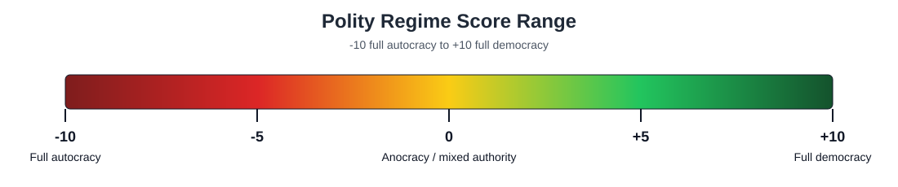

# Data Memo — Regime Type (Polity5): Myanmar Operationalization Outline

**Target length:** 800 words total, excluding footnotes/references if allowed.  
**Course:** GPCO 410 — International Politics & Security  
**Dataset:** Polity5 v2018 annual time-series, Center for Systemic Peace / INSCR  
**Observation:** Myanmar (Burma), `ccode = 775`; observed Polity data through 2018, with the 2021 coup used as an out-of-sample stress test.

## Thesis

Polity5 usefully operationalizes regime type by translating observable authority characteristics into a reproducible `-10` to `+10` score, but Myanmar shows a limit of that operationalization. The dataset codes Myanmar's 2016-2018 regime as near-democratic (`polity2 = +8`) because formal executive constraints and electoral competition increased after the 2015 transition. That coding is defensible under Polity's rules, but it overstates effective democracy because the military retained reserved legislative seats, coercive ministries, and a constitutional veto. The memo should argue that Polity should be augmented with a civilian-control or military-veto measure when reserved military power makes coup reversal plausible.

## 1. Introduction

Open by identifying the dataset and observation. The Polity Project, maintained through the Center for Systemic Peace, gathers and aggregates regime-authority data across countries over time. Polity5 covers regime characteristics and transitions from 1800 to 2018, with the annual time-series most useful for post-1946 country-year analysis. The relevant observation is Myanmar in the Polity5 v2018 annual series.

Explain the basic scale simply. Polity combines institutionalized democracy and autocracy scores into a single regime measure ranging from `-10` for full autocracy to `+10` for full democracy. It is "reproducible" in the limited sense that coders apply a published codebook to the same country-year categories; it is not a mechanical count of veto players. The same coding rules that make comparison possible can still hide important institutional details.

## 2. Operationalization

Polity calculates the raw `polity` score as:

`POLITY = DEMOC - AUTOC`

`DEMOC` and `AUTOC` are additive 0-10 indices built from ordinal component judgments. For democracy, Polity weights elected executive recruitment, open recruitment, executive constraints, and competitive participation. The codebook explicitly treats democracy as a variable, not an all-or-nothing category.

The rules are transparent at the component level but still require coder judgment. Coders classify the country-year's authority pattern on published categories, then the index converts those categories into fixed point values. That means the aggregate score is only as conceptually complete as the component list: Polity can code executive constraint, but it does not separately code whether the coercive core of the state is under elected civilian control.

`polity2` modifies `polity` for time-series analysis by converting special authority codes into usable numeric values. The key rule is `-88`, which means transition. When a country receives `-88`, Polity does not treat that year as a normal regime score; `polity2` prorates between the previous stable score and the following stable score. That means a transition-year `polity2` value is not necessarily a substantive regime judgment. It is a time-series interpolation.

Three component variables explain Myanmar's jump. `xrcomp` and `xropen` measure how competitive and open executive recruitment is. In the 2010 country report, Polity described Myanmar as an "executive-guided transition" because the military had created the 2008 Constitution, controlled the transition to civilian rule, and reserved a formal role in choosing political leadership. `xconst` ranges from `1` to `7`: `1` means unlimited executive authority, `3` means slight-to-moderate limitations, `5` means substantial limitations, and `7` means executive parity or subordination to accountability groups. Polity is measuring the degree of institutional constraint on the chief executive, whether that constraint comes from legislatures, courts, parties, councils, or even the military in coup-prone polities.

`parcomp` ranges from `0` to `5`: `0` is not applicable, `1` repressed, `2` suppressed, `3` factional, `4` transitional, and `5` competitive. It measures how free organized political participation is from government control, not just whether elections exist.

| Variable | Myanmar codes | What it captures | What it misses |
|---|---:|---|---|
| 2010 country report | `polity = -6`; `xrcomp = 0`; `xconst = 2`; `parcomp = 1` | Military-guided transition, few institutional constraints, repressed participation | Already notes the military's reserved constitutional role |
| `polity` | `-3` in 2011-2014; `-88` in 2015; `+8` in 2016-2018 | Raw regime classification | Transition detail can disappear in aggregate use |
| `polity2` | `-3`, then `2`, then `+8` | Regression-ready time series | Smooths a messy transition |
| `xrcomp` / `xropen` | `0/0` before 2015; `2/4` in 2016-2018 | Recruitment moved from non-elective military guidance toward open electoral/parliamentary selection | Does not ask whether the military still controls the playing field |
| `xconst` | `3`, then `-88`, then `7` | Institutional checks on the chief executive | Military constraint can look like democratic accountability |
| `parcomp` | `2`, then `-88`, then `4` | Participation becoming less suppressed and more competitive | Does not directly measure military veto/coup capacity |

## 3. Myanmar Application

Apply those coding rules to Myanmar's transition. Polity records Myanmar as `polity2 = -3` from 2011-2014, marks 2015 as a transition year with raw `polity = -88`, then codes 2016-2018 as `polity2 = +8`. The component shift is concentrated in the variables Polity weights: 2011-2014 stays at `xrcomp = 0`, `xropen = 0`, `xconst = 3`, `parcomp = 2`, `democ = 0`, `autoc = 3`, and `polity = -3`; 2016-2018 moves to `xrcomp = 2`, `xropen = 4`, `xconst = 7`, `parcomp = 4`, `democ = 8`, `autoc = 0`, and `polity = +8`. On paper, this looks like a movement from military-managed anocracy to near-full democracy.

The 2010 country report helps explain why the score later rose so sharply. In 2010, Polity saw the regime as a military-guided transition: executive recruitment was not yet competitive, constraints on the executive were slight and mostly internal to the junta, and participation was repressed. Its narrative describes the 2010 election as USDP-dominated, the NLD as excluded or boycotting, and opposition/ethnic participation as tightly supervised. After the 2015 election and transfer to the NLD-led civilian government, the component values changed in the dimensions Polity weights most heavily: executive recruitment became more open, participation became transitional rather than repressed, and `xconst` moved to executive parity/subordination. Those changes mechanically raise `DEMOC` and reduce `AUTOC`.

The problem is that Myanmar's democratic opening remained structurally constrained. The 2008 Constitution reserved 25 percent of parliamentary seats for military appointees, protected military control over key coercive ministries, and required more than 75 percent legislative approval for major constitutional amendments. The 2010 Polity report explicitly recognized these military-reserved powers, including the military's legislative bloc, constitutional veto, security ministries, commander-in-chief powers, and emergency authority. The critique is therefore not that coders simply missed the military. The critique is that the aggregate `polity` score had no separate civilian-control component, meaning elected civilian leaders could win elections without controlling the coercive core of the state.

This is where `xconst = 7` becomes the most important problem. Polity treats the civilian executive as strongly constrained, but in Myanmar some of those constraints came from unelected military power. For democracy, that is not simply accountability; it is incomplete civilian control. The 2021 military coup is outside Polity5 v2018's observed period, but it is a strong stress test: the high democracy score did not capture the continued coup capacity built into the regime.

## 4. Conclusion / Critique

Polity's strength is reproducibility. Its coding rules let researchers compare regime authority across countries and time, and Myanmar's score change is not arbitrary: formal elections, executive constraints, and participation did change.

Its weakness is aggregation. A high `polity2` score can make a reserved-domain regime look more democratic than it is because `POLITY = DEMOC - AUTOC` has no term for civilian control over coercive institutions. Myanmar shows why this matters for IR security: if the military retains guaranteed seats, constitutional veto power, and control over coercive institutions, democratization may remain reversible by coup. A better operationalization would either discount high democracy scores when unelected actors retain veto power or add a civilian-control-of-coercion variable. In Myanmar, that augmentation would flag the 2016-2018 regime as a hybrid military-veto democracy rather than a consolidated democracy.

## APA Sources

Center for Systemic Peace. (n.d.). *INSCR data page*. Retrieved May 13, 2026, from https://www.systemicpeace.org/inscrdata.html

Center for Systemic Peace. (2011). *Polity IV country report 2010: Myanmar (Burma)*. https://www.systemicpeace.org/polity/Myanmar2010.pdf

Cederman, L.-E., Hug, S., & Krebs, L. F. (2010). Democratization and civil war: Empirical evidence. *Journal of Peace Research, 47*(4), 377-394. https://doi.org/10.1177/0022343310368336

Constitution of the Republic of the Union of Myanmar. (2008). https://www.burmalibrary.org/docs11/Constitution-of-the-Republic-of-the-Union-of-Myanmar-2008.pdf

International Crisis Group. (2021). *Responding to the Myanmar coup* (Asia Briefing No. 166). https://www.crisisgroup.org/asia/south-east-asia/myanmar/b166-responding-myanmar-coup

Little, A. T., & Meng, A. (2024). Measuring democratic backsliding. *PS: Political Science & Politics*. https://doi.org/10.1017/S104909652300063X

Marshall, M. G., & Gurr, T. R. (2020). *Polity5: Political regime characteristics and transitions, 1800-2018: Dataset users' manual*. Center for Systemic Peace. https://www.systemicpeace.org/inscr/p5manualv2018.pdf

---
Generated for: Edgar Agunias  
Date: 2026-05-13  
Model: GPT-5 (Codex)  
Sources: Canvas rubric export, Polity5 codebook and data, Polity IV Myanmar country report, Myanmar 2008 Constitution, International Crisis Group, Meng & Little, Cederman et al.  
Agent: Athena (GPCO 410 course agent), invoked locally by Claudia
