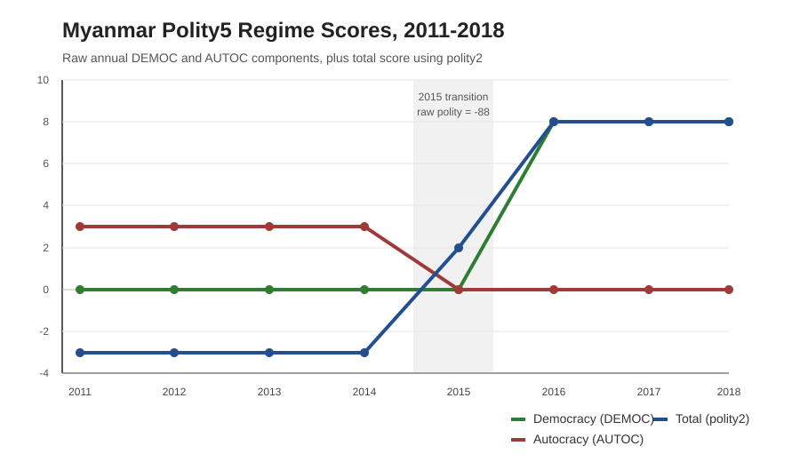

# Data Memo: Polity5 and Myanmar's Military-Veto Transition

## Introduction

This memo examines Polity5's coding of Myanmar in the v2018 annual time-series. Polity5, produced by the Center for Systemic Peace, operationalizes regime type by translating observable authority characteristics into a comparable `-10` to `+10` score. The observation is Myanmar/Burma, country code 775, with the main coding puzzle in the 2011-2018 transition period. Polity codes Myanmar's 2016-2018 regime as near-democratic (`polity2 = +8`) because formal executive recruitment, executive constraint, and participation all improved after the 2015 election. That coding is defensible under Polity's rules, but it overstates effective democracy because the military retained reserved legislative seats, coercive ministries, and a constitutional veto. The core issue is not that Polity ignored the military. It is that the aggregate score has no separate civilian-control or military-veto measure.[^1]

## Operationalization

Polity's raw score is calculated as `POLITY = DEMOC - AUTOC`. `DEMOC` and `AUTOC` are additive 0-10 indices built from ordinal component judgments. For democracy, Polity weights elected executive recruitment, open recruitment, executive constraints, and competitive participation. This makes Polity reproducible in a limited but important sense: coders apply a published codebook to observable country-year categories. It is not, however, a mechanical count of veto players or coercive power.

`POLITY2` modifies `POLITY` for time-series analysis by converting special authority codes into usable numeric values. The key rule for Myanmar is `-88`, meaning transition. When a country receives `-88`, Polity does not treat that year as a normal regime score; `polity2` prorates between the prior stable score and the following stable score. Myanmar's `polity2 = 2` in 2015 is therefore an interpolation, not a substantive judgment that the regime was exactly a weak democracy.[^2]

Three component variables explain Myanmar's jump. `xrcomp` and `xropen` measure how competitive and open executive recruitment is. `xconst` ranges from `1` for unlimited executive authority to `7` for executive parity or subordination. Polity measures constraint on the chief executive whether the accountability group is a legislature, court, party, council, or military in a coup-prone polity. `parcomp` measures how free organized political participation is from government control, from repressed to competitive.[^3] These rules are transparent at the component level, but the aggregate score is only as complete as the component list. Polity can code executive constraint, but it does not separately code whether elected civilians control the coercive core of the state.

## Myanmar Application

The annual scores show the change directly:[^4]

| Year | Democracy (`DEMOC`) | Autocracy (`AUTOC`) | Total score (`polity2`) |
|---:|---:|---:|---:|
| 2011 | 0 | 3 | -3 |
| 2012 | 0 | 3 | -3 |
| 2013 | 0 | 3 | -3 |
| 2014 | 0 | 3 | -3 |
| 2015 | transition-coded | transition-coded | 2 |
| 2016 | 8 | 0 | 8 |
| 2017 | 8 | 0 | 8 |
| 2018 | 8 | 0 | 8 |

The table and chart show why the Polity score is defensible but incomplete. The numbers move sharply after 2015: `DEMOC` rises from `0` to `8`, `AUTOC` falls from `3` to `0`, and `polity2` jumps from `-3` to `+8`. Polity's own rules explain this because recruitment opened, participation became less repressed, and `xconst` moved to executive parity/subordination. But the 2010 Polity country report already recognized Myanmar's military-reserved powers, including the military's legislative bloc, constitutional veto, security ministries, commander-in-chief powers, and emergency authority.[^5] The critique is therefore not coder ignorance. The critique is aggregation: elected civilian leaders could win elections without controlling the coercive core of the state, yet the aggregate score still looked near-democratic.

## Conclusion / Critique

Polity's strength is reproducibility. Its rules let researchers compare regime authority across countries and time, and Myanmar's score change is not arbitrary. Elections, recruitment, participation, and institutional constraints really did change after 2015. The coding should preserve that movement rather than treat the transition as fake.

Its weakness is aggregation. A high `polity2` score can make a reserved-domain regime look more democratic than it is because `POLITY = DEMOC - AUTOC` has no term for civilian control over coercive institutions. If Myanmar is read as a near-democracy that collapsed in 2021, the lesson is sudden democratic failure. If it is read as a military-veto transition, the lesson is that democratization remained reversible because elected officials never fully controlled the armed forces, security ministries, or amendment process.

I would therefore add a civilian-control or military-veto flag. Myanmar should still receive credit for more open recruitment and less repressed participation in 2016-2018, but high democracy scores should be discounted or flagged when unelected actors retain guaranteed seats, constitutional veto power, and control over coercive institutions. That would mark Myanmar as a hybrid military-veto democracy rather than a consolidated democracy. For Polity users, the implication is simple: do not treat high `polity2` values as sufficient evidence of democratic consolidation in reserved-domain cases. Drill down into components, then ask who controls coercion.

## References

Center for Systemic Peace. (2011). *Polity IV country report 2010: Myanmar (Burma)*. https://www.systemicpeace.org/polity/Myanmar2010.pdf

Marshall, M. G., & Gurr, T. R. (2020). *Polity5: Political regime characteristics and transitions, 1800-2018: Dataset users' manual*. Center for Systemic Peace. https://www.systemicpeace.org/inscr/p5manualv2018.pdf

Marshall, M. G., & Gurr, T. R. (2020). *Polity5 annual time-series, 1800-2018* [Data set]. Center for Systemic Peace. https://www.systemicpeace.org/inscrdata.html

## AI Use Disclosure

I used GPT-5 via the Claudia agent system to assist with outlining, source verification, and drafting this working version of the data memo. I will personally review and verify all factual claims, citations, and analysis before submission, revise the final text to reflect my own judgment and voice, and accept full intellectual and academic responsibility for the final submission, including any errors.

[^1]: Marshall and Gurr, *Polity5: Dataset Users' Manual*, pp. 13-17, 67-69; Center for Systemic Peace, *Polity IV Country Report 2010: Myanmar (Burma)*, pp. 1-3.
[^2]: Marshall and Gurr, *Polity5: Dataset Users' Manual*, pp. 13-17; local extract `myanmar_polity5_2000_2018.csv`.
[^3]: Marshall and Gurr, *Polity5: Dataset Users' Manual*, pp. 13-17, 67-78.
[^4]: Local extract `myanmar_polity5_2000_2018.csv`, rows for Myanmar, 2011-2018.
[^5]: Center for Systemic Peace, *Polity IV Country Report 2010: Myanmar (Burma)*, pp. 1-3.

---
Generated for: Edgar Agunias
Date: 2026-05-15
Model: GPT-5 (Codex, medium reasoning)
Sources: `Data_Memo_RegimeType_Myanmar_OUTLINE.md`; `myanmar_polity5_2000_2018.csv`; `polity5_v2018_codebook.pdf`; `Myanmar2010.pdf`; `prompt.md`
Agent: Athena, coordinated by Claudia
---
