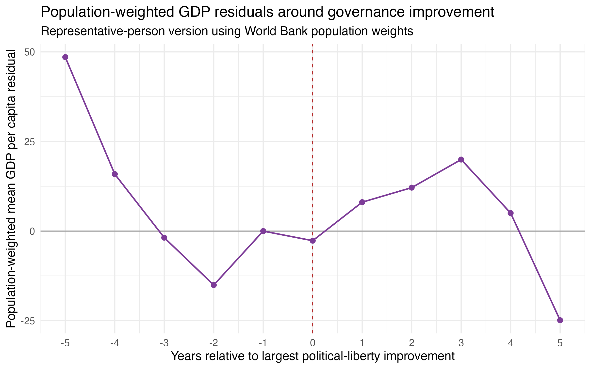
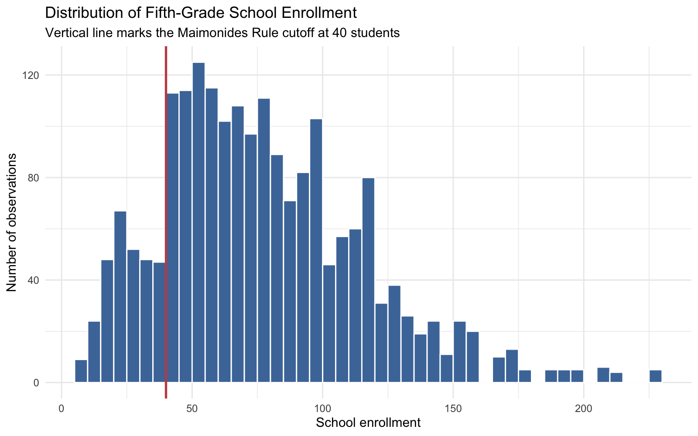
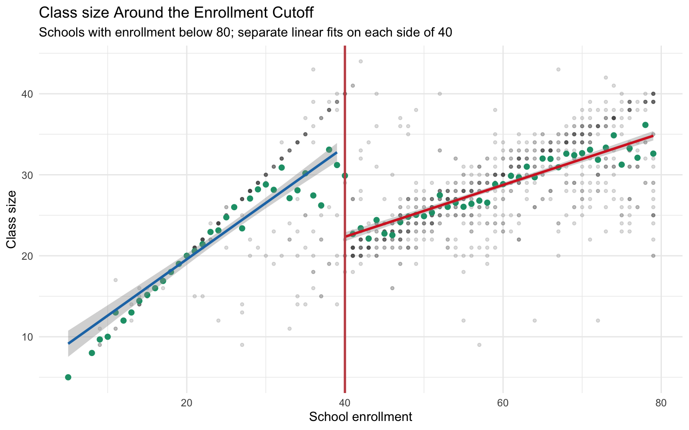
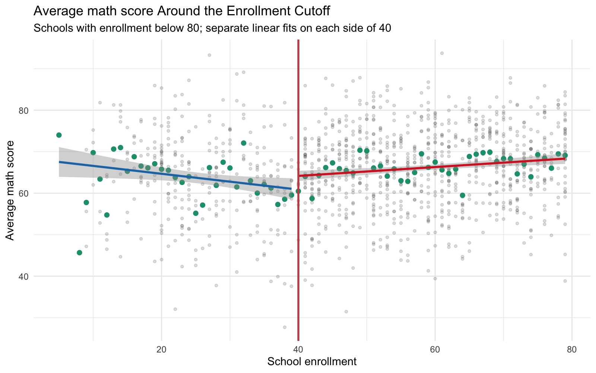
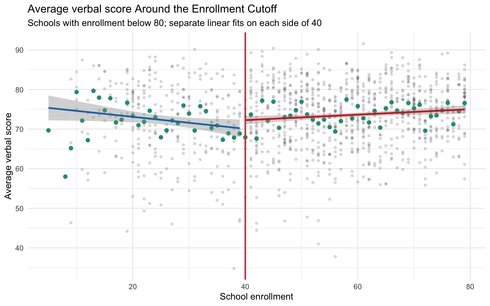

# Homework 2: Panel and Regression Discontinuity

Edgar Agunias  
GPEC 446 - Quantitative Methods 3  
May 2026

## Part I: Panel and Two-Way Fixed Effects

### Q1

The governance panel covers African country-years from 1985 to 1998. I generated a numeric country identifier and year dummies, then estimated (1) pooled OLS with year fixed effects and (2) a country fixed-effects model with year fixed effects.

**Table 1. GDP per capita and political liberties, average-country estimates**

| Model | Term | Estimate | Std. Error | t statistic | p value | N | R-squared |
|---|---:|---:|---:|---:|---:|---:|---:|
| Pooled OLS + year FE | pol_lib | 228.965 | 55.203 | 4.148 | <0.001 | 623 | 0.028 |
| Within/LSDV: country FE + year FE | pol_lib | -0.188 | 14.113 | -0.013 | 0.989 | 623 | 0.972 |

In the pooled model, higher political-liberty scores are associated with higher GDP per capita. A one-point increase in the political-liberty scale is associated with about $229 higher GDP per capita. In the within-country model, the estimate is basically zero. This means richer countries are better governed on average, but the same country is not clearly richer in years when its political-liberty score is higher after controlling for country and year fixed effects.

### Q2

I used `bigimp` to mark the year of each country's largest improvement in political liberties. The two-way fixed-effects regression uses GDP per capita as the outcome and includes country and year fixed effects.

**Table 2. TWFE estimate for large governance improvement year**

| Model | Term | Estimate | Std. Error | t statistic | p value | N | R-squared |
|---|---:|---:|---:|---:|---:|---:|---:|
| TWFE big improvement indicator | bigimp | -2.855 | 56.887 | -0.050 | 0.960 | 623 | 0.972 |

The point estimate is very small relative to the standard error, so the TWFE regression does not show a clear GDP increase in the exact year of a large governance improvement.

**Figure 1. Lab 5-style event-study coefficients around large governance improvements**

The event-study figure follows the same structure as Lab 5: create event time around treatment, omit year -1 as the reference period, estimate one coefficient for each lead and lag, and plot the coefficients with 95% confidence intervals. The pre-improvement coefficients do not show a clear rising pattern that would suggest income growth consistently comes before governance improvement. The post-improvement coefficients are also noisy and do not show a clear sustained increase after the event. My reading is that the timing evidence is weak rather than a clean story of income causing governance or governance causing income.

### Q3

Richer African countries appear better governed on average in the pooled comparison, but the within-country estimates are much weaker. That distinction matters: the pooled result mostly compares different countries, while the fixed-effects result asks whether a given country becomes richer when its own governance score changes.

Based on Q1 and Q2, I would not strongly expect political improvements just because an African country has a rapidly expanding economy. Faster growth could make political change easier, but the event-study evidence here does not show a clear pattern of GDP rising before large governance improvements. The safest conclusion is that income and governance are positively associated across countries, but this homework evidence is not enough to claim a causal timing relationship.

### Q4

To shift from the average country to the representative person, I added World Bank population data and estimated population-weighted versions of the pooled and fixed-effects models. This gives more influence to country-years where more people live.

**Table 3. GDP per capita and political liberties, representative-person estimates**

| Model | Term | Estimate | Std. Error | t statistic | p value | N | R-squared |
|---|---:|---:|---:|---:|---:|---:|---:|
| Population-weighted pooled OLS + year FE | pol_lib | 179.305 | 40.217 | 4.458 | <0.001 | 623 | 0.034 |
| Population-weighted country FE + year FE | pol_lib | -2.895 | 6.922 | -0.418 | 0.676 | 623 | 0.986 |

**Figure 2. Population-weighted event-study residual GDP per capita**

Population weighting changes the estimand from the average country-year to the average person-year. Large countries such as Nigeria, Ethiopia, Democratic Republic of Congo, South Africa, Tanzania, Kenya, Sudan, and Uganda get much more weight than small countries. The weighted pooled estimate is still positive, but smaller than the unweighted pooled estimate. The weighted fixed-effects estimate remains near zero and statistically insignificant. So the representative-person version does not change the main conclusion: richer places tend to be better governed in cross-country comparisons, but the within-country and event-study evidence does not show a clear causal or timing pattern.

## Part II: Regression Discontinuity Design

### Q5

In Angrist and Lavy (1999), the endogeneity problem is that class size is not randomly assigned in a simple OLS regression of test scores on class size. Schools with smaller classes may also have richer parents, better teachers, more resources, different peer groups, or different neighborhood characteristics. Those omitted factors also affect test scores.

If advantaged families sort into schools with smaller classes, OLS would make small classes look more beneficial than they really are, so it would overestimate the benefit of reducing class size. There is also a possible opposite bias: schools might place weaker or more disadvantaged students into smaller classes, which would make small classes look less helpful. My main expectation is that naive OLS likely overstates the benefit of small classes because family and school advantage are hard to fully control.

### Q6

**Figure 3. Histogram of fifth-grade school enrollment**

The histogram does not show obvious bunching right around the enrollment cutoff of 40. If parents were strongly choosing schools based on Maimonides' Rule, I would expect suspicious piling up just below or just above the cutoff. Since that pattern is not visually clear, the running variable looks more credible. This does not prove there is no manipulation, but it makes the RD design more plausible.

### Q7

**Figure 4. Class size around the Maimonides' Rule cutoff**

**Figure 5. Math scores around the Maimonides' Rule cutoff**

**Figure 6. Verbal scores around the Maimonides' Rule cutoff**

The class-size plot shows the expected first-stage pattern at the cutoff: once enrollment crosses 40, the rule tends to open a second class, so average class size drops. The math and verbal score plots are noisier, but both show higher scores just above the cutoff in the local estimates. This is consistent with a smaller-class benefit near the cutoff, but the raw plots alone should not be treated as the full causal proof. The stronger RD argument comes from comparing observations very close to the cutoff, where schools just below and just above 40 should be similar except for the rule-induced class-size change.

### Q8

For Q8, I restricted the analysis to schools with fewer than 80 students enrolled, as required. The cutoff is 40, so the estimate compares observations just below and just above the point where Maimonides' Rule opens a second class.

#### Q8a

I manually estimated local linear regressions on each side of the cutoff using a bandwidth of 10 students. I chose 10 because it keeps the comparison local to the cutoff while leaving enough observations on both sides to estimate the relationship.

**Table 4. Manual local linear RD estimates, bandwidth 10**

| Outcome | Cutoff | Bandwidth | Estimate | Std. Error | p value | N left | N right |
|---|---:|---:|---:|---:|---:|---:|---:|
| avgmath | 40 | 10 | 4.261 | 2.570 | 0.098 | 96 | 236 |
| avgverb | 40 | 10 | 4.319 | 2.295 | 0.061 | 96 | 236 |

The manual estimates are positive: crossing the cutoff is associated with about 4.3 points higher math and verbal scores. Since crossing 40 also lowers class size, this is consistent with the idea that smaller classes improve scores near the cutoff. The estimates are suggestive but not extremely precise.

#### Q8b

I then re-estimated the RD using `rdrobust` with default settings.

**Table 5. rdrobust default RD estimates**

| Outcome | Cutoff | Estimate | Std. Error | 95% CI low | 95% CI high | Bandwidth left | Bandwidth right | N left | N right |
|---|---:|---:|---:|---:|---:|---:|---:|---:|---:|
| avgmath | 40 | 2.939 | 3.753 | -4.416 | 10.294 | 7.901 | 7.901 | 70 | 172 |
| avgverb | 40 | 3.623 | 3.706 | -3.640 | 10.887 | 8.186 | 8.186 | 79 | 198 |

The `rdrobust` estimates have the same positive sign as the manual estimates, but they are smaller and less precise. The confidence intervals include zero for both outcomes. The difference is reasonable because `rdrobust` chooses a narrower bandwidth and uses its own weighting and inference procedure. Substantively, both approaches point in the same direction, but the uncertainty means the result should be described cautiously.

### Q9

I used a covariate smoothness test with `disadvantaged` as the outcome. This is a useful falsification test because disadvantage should be predetermined relative to the enrollment rule. If disadvantaged status jumps at the cutoff, then schools just below and just above 40 may not be comparable.

**Table 6. Falsification test: discontinuity in disadvantaged share**

| Outcome | Cutoff | Bandwidth | Estimate | Std. Error | p value | N left | N right |
|---|---:|---:|---:|---:|---:|---:|---:|
| disadvantaged | 40 | 10 | 4.819 | 4.368 | 0.271 | 96 | 236 |

The estimated discontinuity in disadvantaged share is positive but not statistically significant. I would not treat this as evidence of a clear composition jump at the cutoff. If this test had failed, it would weaken the RD design because the achievement difference could reflect different student backgrounds rather than the rule-induced change in class size. Here, the falsification test is reassuring, though not a guarantee that all RD assumptions hold.

## Caveats Before Submission

- Edgar should review the two R scripts line by line before submitting because the assignment says students may be asked to explain every line of code and interpretation.
- The Part II paper PDF in the folder is scan-only, so the Q5 writeup relies on the assignment prompt, local notes, and the known Angrist and Lavy (1999) paper citation rather than machine-readable extraction from the local scan.
- The RD score estimates are suggestive, but the `rdrobust` confidence intervals include zero. The final answer should avoid overstating the causal evidence.
- The Part I World Bank join has 21 missing country-year rows, concentrated in Eritrea and Somalia.

## References

Angrist, J. D., & Lavy, V. (1999). Using Maimonides' Rule to estimate the effect of class size on scholastic achievement. *The Quarterly Journal of Economics, 114*(2), 533-575. https://doi.org/10.1162/003355399556061

## AI Use Disclosure

I used GPT-5 via the Claudia agent system to assist with code drafting, debugging, statistical analysis, data transformation, report organization, and prose drafting for this assignment. I reviewed, ran, and verified all code and output. Any interpretation, written analysis, and conclusions are my own. I accept full intellectual and academic responsibility for the final submission, including any errors.

---
Generated for: Edgar Agunias
Date: 2026-05-19
Model: GPT-5 Codex
Sources: Homework 2 assignment PDFs; Homework_2_Report_Skeleton.md; PART_I_NOTES.md; PART_II_NOTES.md; outputs/part_i CSV and PNG files; outputs/part_ii CSV, TXT, and PNG files; Tyche context and feedback; Claudia output disclosure and AI disclosure SOPs
Agent: Tyche
---
